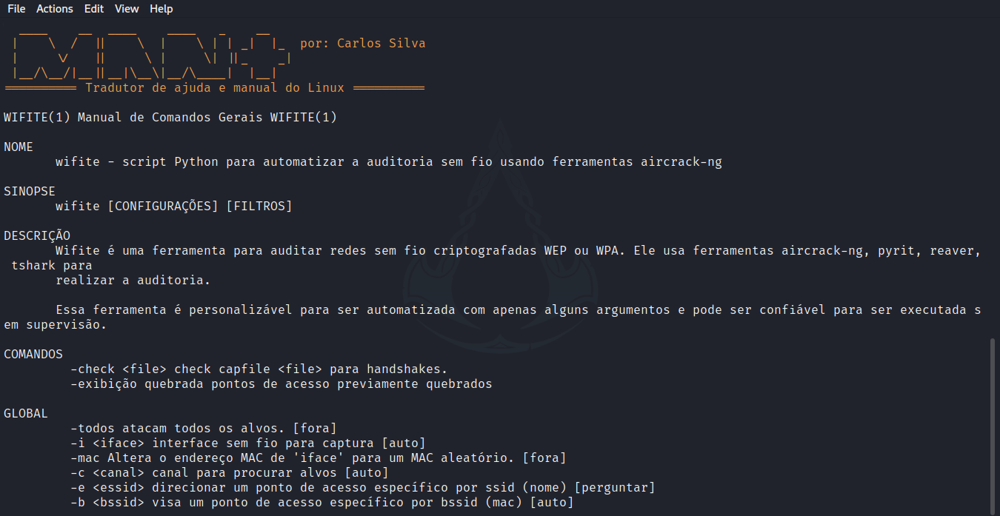
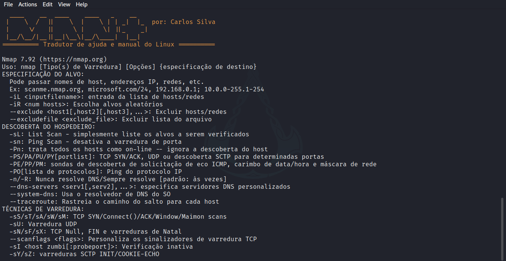

<h1 align=center>Mant</h1>
<h3>Tradutor de ajuda, Manual do Linux e Textos</h3>

<div align=center>
    
    
</div>

Não saber inglês torna-se um grande pé no saco na maioria da vezes já que a maioria das ferramentas são escritas em inglês e torna-se difícil ler manual e o help de ferramentas para algumas pessoas.

Então resolvir fazer essa ferramenta que traduz o help e o man de ferramentas do Linux🐧 para ajudar essas pessoas e me ajuda também.


## Instalação:
💻 derivados do Debian:

```
git clone https://github.com/CarlosAllberto/mant
cd mant
chmod +x install.sh
sudo ./install.sh
```

📱 Termux:

```
git clone https://github.com/CarlosAllberto/mant
cd mant
chmod +x install.sh
./install.sh
```

## Desinstalar

```
./remove.sh
```

## Run:

```
-- MODO DE USO --

OPCOES:
    -m, --man:  mostra o manual da ferramenta escolhida.
    -h, --help: mostra a ajuda/help da ferramenta escolhida.
    -H:         mostra o help do MANT, esse que voce esta vendo.

COMO CORRER:
    mant <SCRIPT> <OPCAO>
    EXEMPLO: mant nmap -h
```

## License

[](LICENSE)
