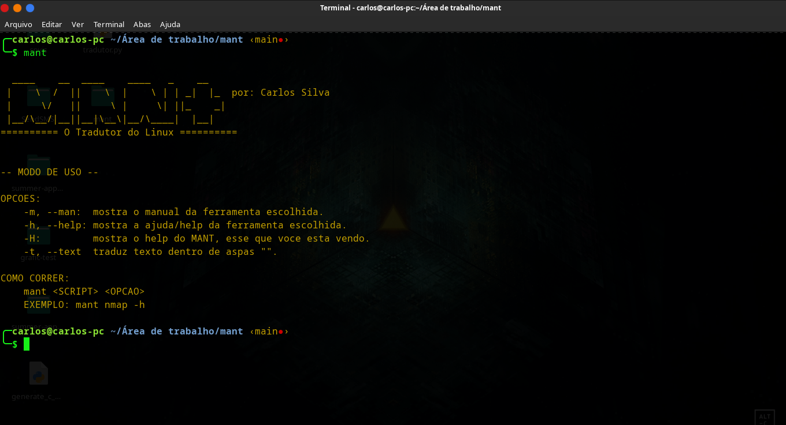
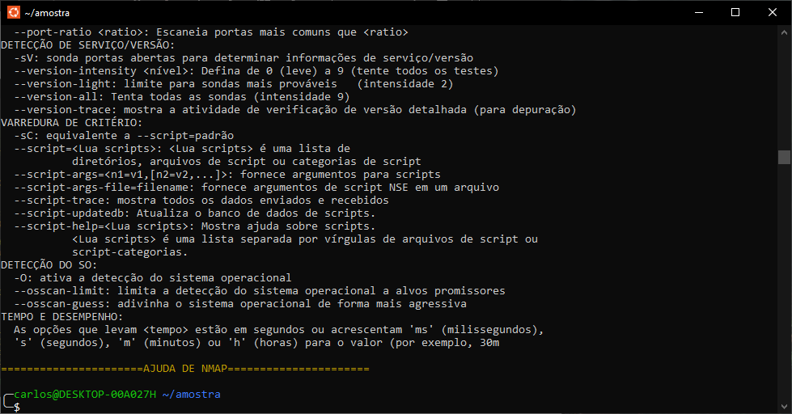

```
  ____    __  ____    ____   _    __    
 |    \  /  ||    \  |    \ | | _|  |_  por: Carlos Alberto
 |     \/   ||     \ |     \| ||_    _| 
 |__/\__/|__||__|\__\|__/\____|  |__|   
========== O tradutor do Linux ==========
```

<h3>Tradutor facil e útil</h3>

<div align=center>
    
    
</div>

### Oque ele traduz?

- [x] Texto
- [x] Manual do linux (man)
- [x] Help do linux (help)
- [x] Arquivos de Texto
- [x] PDF (apenas desktop)

Não saber inglês torna-se um grande pé no saco na maioria da vezes já que a maioria das ferramentas são escritas em inglês e torna-se difícil ler manual e o help de ferramentas para algumas pessoas.

Então resolvir fazer essa ferramenta que traduz o help e o man de ferramentas do Linux🐧 para ajudar essas pessoas e me ajudar também.


## Instalação:
### 💻 Derivados do Debian:

```
git clone https://github.com/CarlosAllberto/mant
cd mant
chmod +x install.sh
sudo ./install.sh
```

Em uma linha:

```
git clone https://github.com/CarlosAllberto/mant && cd mant && chmod +x install.sh && sudo ./install.sh
```

### 📱 Termux:

```
git clone https://github.com/CarlosAllberto/mant
cd mant
chmod +x install.sh
./install.sh
```

Em uma linha:

```
git clone https://github.com/CarlosAllberto/mant && cd mant && chmod +x install.sh && ./install.sh
```

## Desinstalar

```
./remove.sh
```

## Adicionando fonte
Agora não é mais preciso adicionar fontes.
A fonte é inserida de forma automatica

## Run:

```
-- MODO DE USO --

OPCOES:
    -m, --man:     mostra o manual da ferramenta escolhida.
    -h, --help:    mostra a ajuda/help da ferramenta escolhida.
    -H:            mostra o help do MANT, esse que voce esta vendo.
    -t, --text:    traduz texto dentro de aspas "".
    -a, --arquive: traduz arquivo de texto.
    -p, --pdf:     traduz pdf

COMO CORRER:
    mant <SCRIPT> <OPCAO>

EXEMPLOS:
    mant nmap -h
    mant git -m
    mant "hello my friend" -t
    mant arquivo.txt -a
    mant arquivo.pdf -p
```

## License

[](LICENSE)
